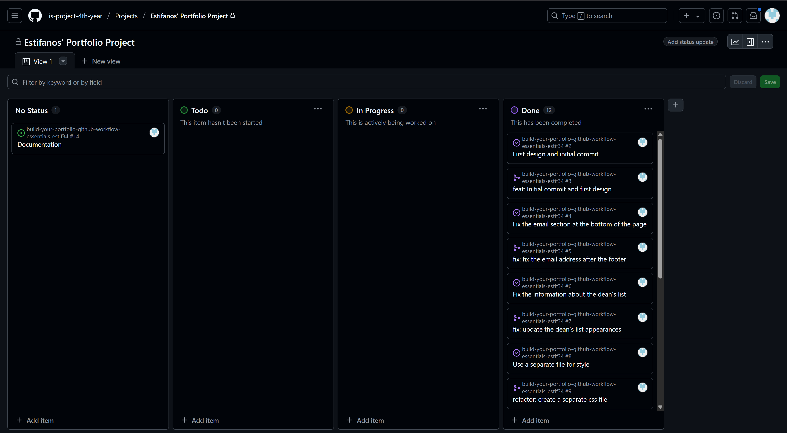

# Personal Portfolio Documentation

## 1. Student Details

- **Full Name**: Gebremedhin, Estifanos Solomon
- **Admission Number**: 148905
- **GitHub Username**: estif34
- **Email**: estifanos.gebremedhin@strathmore.edu

## 2. Deployed Portfolio Link

- **GitHub Pages URL**:  
  [Estifanos' Portfolio website](https://is-project-4th-year.github.io/build-your-portfolio-github-workflow-essentials-estif34/)

## 3. Learnings from the Git Crash Program

Write about **4 things** you expected to learn during the Git crash course (yes, we all came in with some big hopes 😅).
For each one, mention:

What you thought it would be like **(Expectation 👀)**

What you actually learned **(Reality 😅)**

And how it helped with your personal portfolio project 💻

make it honest—and if it surprised you, even better!

**🧠 What I Thought I'd Learn vs What I Actually Learned**  
**1. Concept: GitHub Project Boards**

`Expectation 👀`: I thought project boards were just for big tech teams managing massive apps with dozens of people.

`Reality 😅`: Even a solo dev like me can use the “To Do,” “In Progress,” and “Done” columns to stay organized and focused.

`Impact 💡`: I used the board to plan out each section of my personal portfolio—from layout to responsiveness. Helped me avoid bouncing between tasks and actually finish things.

---

**2. Concept: GitHub Milestones**

`Expectation 👀`: I assumed milestones were more for product managers or teams working toward big release deadlines.

`Reality 😅`: Milestones make it easier to break a project into manageable chunks.

`Impact 💡`: I set a milestone for my tasks like building and deploying the site. 

---

**3. Concept: GitHub Issues for Changes & Features**

`Expectation 👀`: I thought issues were only used for bug reporting in open source projects and not for something small like my portfolio.

`Reality 😅`: GitHub Issues are actually perfect for managing feature requests, bugs, and improvements.

`Impact 💡`: I created issues and linked them to commits so I could see what changes fixed what.

---

**4. Concept: Using the GitHub GUI for Commits & PRs**

`Expectation 👀`: I thought everything had to be done through the terminal and that the GUI was just for beginners.

`Reality 😅`: The GitHub GUI is super intuitive and great for quickly creating commits, opening pull requests, and merging.

`Impact 💡`: I used the GUI to open a PR merged once I was happy. It gave me a cleaner workflow than just committing straight to main.

---

## 4. Screenshots of Key GitHub Features

Include screenshots that demonstrate how you used GitHub to manage your project. For each screenshot, write a short caption explaining what it shows.

> Upload the screenshots to your GitHub repository and reference them here using Markdown image syntax:
> (you could just simply copy and paste the image into the Assignment.md)

```markdown

```

### A. Milestones and Issues

- Screenshot showing your milestone(s) and the issues linked to it.

 
### B. Project Board

- Screenshot of your GitHub Project Board with issues organized into columns (e.g., To Do, In Progress, Done).

### C. Branching

- Screenshot showing your branch list with meaningful naming.

### D. Pull Requests

- Screenshot of a pull request that’s either open or merged and linked to a related issue.

### E. Merge Conflict Resolution

- Screenshot of a resolved merge conflict (in a pull request, commit history, or your local terminal/GitHub Desktop).
